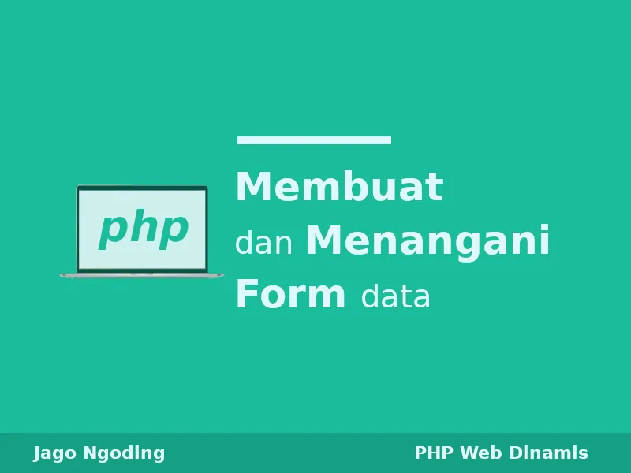

# index.html

```html
<html>
<head>
	<title>Afra Nesya Apriyanthi Blog</title>
	<link rel="stylesheet" type="text/css" href="style.css">
</head>
<body>
	<div id="container">
	<header>
		<div class="atas">
		<h1>Afra Nesya Apriyanthi Blog</h1>
		<p>Belajar pemrograman web, mobile dan desktop lengkap berbahasa indonesia, dari dasar hingga mahir.</p>
		</div>
	</header>

	<main>
	<div class="wrap">
		<nav class="menu">
			<ul>
				<li>
					<a href="index.html">Home</a>
				</li>
				<li>
					<a href="tutorial.html">Tutorial</a>
				</li>
				<li>
					<a href="#">Kontak</a>
				</li>
			</ul>
		</nav>

		<aside class="sidebar">
			<div class="widget">
				<h2>Profil</h2>
				
				<p>Nama : Afra Nesya Apriyanthi</p>
			</div>
			<div class="widget">
				<h2>Yuuuk Belajar</h2>
				<p>Situs ini menyediakan banyak tutorial pemrograman web, mobile & desktop.</a>.</p>
				<p><script src="js/myscript.js"></script></p>
			</div>
		</aside>

		<div class="blog">
			<div class="conteudo">
				<div class="post-info">
					Di Posting Oleh <b>Afra Nesya Apriyanthi</b>
				</div>
				
				<h1> Tutorial Belajar PHP Dasar Untuk Pemula </h1>
				<hr>
				<p>
					Ini adalah seri tutorial belajar PHP 7 dasar, semua materi pada seri ini disesuaikan untuk pemula yang ingin memulai perjalanannya sebagai programmer PHP.

					Kita akan mempelajari bahasa pemrograman PHP dari bagiannya yang paling dasar. Mulai dari file PHP, variabel, tipe data, logika, pembahasan tentang fungsi, pembahasan tentang string, array dan lain sebagainya.

					Jika sebelumnya anda pernah belajar bahasa Java, C++, atau bahasa pemrograman yang lainnya, mempelajari bahasa pemrograman PHP akan lebih mudah karena ia masih memiliki beberapa struktur yang sama.

					Akan tetapi jika PHP adalah bahasa pemrograman yang pertama kali anda pelajari, anda tidak perlu khawatir. Dengan mengikuti tutorial PHP ini, insyaallah anda akan bisa menguasainya dengan mudah.
				</p>				
				<a href="tutorial.html" class="continue-lendo">Selengkapnya →</a>
			</div>
			<div class="conteudo">
				<div class="post-info">
					Di Posting Oleh <b>Afra Nesya Apriyanthi</b>
				</div>
				
				<h1> PHP: Membuat Dan Menangani Form </h1>
				<hr>
				<p>
					Ini adalah seri Tutorial PHP yang kedua. Kita telah membahas Tutorial PHP Tingkat Dasar, dan juga Tingkat Menengah. Pada seri lanjutan ini, kita akan mempelajari bahasa pemrograman PHP untuk membangun sebuah web dinamis.
				</p>				
				<a href="#" class="continue-lendo">Selengkapnya →</a>
			</div>
		</div>
	</div>
	</main>
	<div class="clear">	</div>
	<div class="footer">
		Copyright © First -2023. Blog Creative ?with ❤ - Proudly powered by Afra Nesya Apriyanthi
	</div>
	</div>
</body>
</html>
```

# style.css
```css

 
body {
	background: #838383;
	margin:0;
	font-family: 'Open Sans', sans-serif;
}
 
hr {
	border:0;
	background:#dedede;
	height:1px;
}		
 
header{
	text-align: center;
	color: #232323;
}
 
header .judul{
	font-size: 26pt;
	background-color: #00c8eb;
    text-align: center;
    color: white;
}
 
header .deskripsi{
	font-size: 18pt;
	text-align: center;
	color: black;
}

.atas {
   background-color: #00c8eb;
   text-align: center;
   color: white;
}

.wrap {
	width: 950px;
	margin:25px auto;
}
 
nav.menu ul {
	overflow:hidden;
	color:#fff;
	list-style: none;
	float:left;
	padding:0;
	width: 650px;
	margin:0 0 0;
	background: #f6ab6c;
	-webkit-box-shadow: 1px 1px 1px 0px rgba(204,204,204,0.55);
	-moz-box-shadow: 1px 1px 1px 0px rgba(204,204,204,0.55);
	box-shadow: 1px 1px 1px 0px rgba(204,204,204,0.55);
}
 
nav.menu ul li {
	margin:0;
	float:left;
}
 
nav.menu ul a {
	padding:25px;
	display:block;
	font-weight:600;
	font-size: 16px;
	color:#fff;
	text-transform: uppercase;
	transition: all 0.5s ease;
	text-decoration: none;
}
 
nav.menu ul a:hover {
	text-decoration: underline;
	background:#df5e88;
}
 
.sidebar {
	float:right;
	width:275px;
}
 
.sidebar .widget {
	padding:25px;
	margin:0 0 25px;
	background:#fff;
	border-bottom: 2px solid #fff;
	transition: all 0.5s ease;
}
 
.sidebar .widget:hover {
	border-bottom: 2px solid #3498db;
}
 
.sidebar .widget h2 {
	padding:0;
	margin:0 0 15px;
	color:#3498db;
	font-size: 18px;
	font-weight:800;
	text-transform: uppercase;
}
 
.sidebar .widget p {
	font-size: 14px;
}
 
.sidebar .widget p:last-child {
	margin:0;
}
 
.blog {
	float:left;
}
 
.conteudo {
	width:600px;
	padding:25px;
	margin:25px auto;
	background: #fff;
	border:1px solid #dedede;
	-webkit-box-shadow: 1px 1px 1px 0px rgba(204,204,204,0.35);
	-moz-box-shadow: 1px 1px 1px 0px rgba(204,204,204,0.35);
	box-shadow: 1px 1px 1px 0px rgba(204,204,204,0.35);
}
 
.conteudo img {
	min-width: 650px;
	margin:0 0 25px -25px;
	max-width: 650px;
}
 
.conteudo h1 {
	padding:0;
	margin:0 0 15px;
	font-weight: normal;
	color: #666;
	font-family: Georgia;
}
 
.conteudo p:last-child {
	margin: 0;
}
 
.conteudo .continue-lendo {
	color:#000;
	transition: all 0.5s ease;
	text-decoration: none;
	font-weight: 700; 
}
 
.conteudo .continue-lendo:hover {
	margin-left:10px;
}
 
.post-info {
	float: right;
	font-size: 12px;
	margin: -10px 0 15px;
	text-transform: uppercase;
}
 
@media screen and (max-width: 960px) {
 
	.header {
		position:inherit;
	}
 
	.wrap {
		width: 90%;
		margin:25px auto;
	}
	.sidebar {
		width:100%;
		margin:25px 0 0;
		float:right;
	}
 
	.sidebar .widget {
		padding:5%;
	}
 
	nav.menu ul {
		width: 100%;
	}
 
	nav.menu ul {
		float:inherit;
	}
 
	nav.menu ul li {
		float:inherit;
		margin:0;
	}
 
	nav.menu ul a {
		padding:15px;
		font-size: 16px;
		border-top:1px solid #1abf9f;
		border-bottom:1px solid #16a085;
	}
 
	.blog {
		width:90%;
	}
 
	.conteudo {
		float:inherit;
		margin:0 auto 25px;
		width:101%;
		border:1px solid #dedede;
		padding:5%;  
		background: #fff;
	}
 
	.conteudo img {
		max-width: 110%;
		margin:0 0 25px -5%;
		min-width: 110%;
	}
 
	.conteudo .continue-lendo:hover {
		margin-left:0;
	}
 
 
}
 
@media screen and (max-width: 460px) {
 
	nav.menu ul a {
		padding:15px;
		font-size: 14px;
	}
 
	.sidebar {
		display:none
	}
	.post-info {
		display:none;
	}
 
	.conteudo {
		margin:25px auto;
	}
 
	.conteudo img {
		margin:-5% 0 25px -5%;
	}			
}

.footer{
	width: 100%;
	padding: 10px;
	color: white;
	background-color: #00a2c6;
	text-align: center;
	font-weight: bold;
}

.clear{
	clear: both;
}
```
